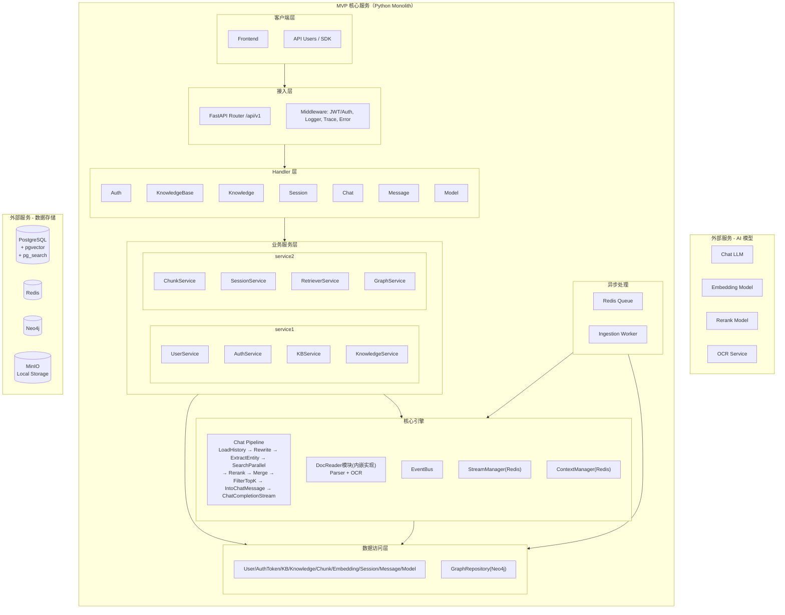
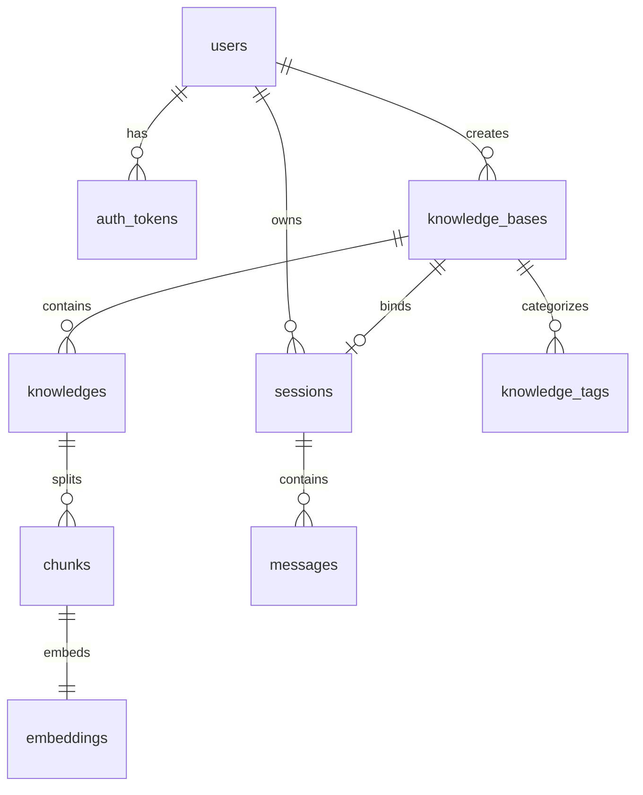

# WeKnora 知识库 Chatbot MVP 项目文档（Python 复现版）

## 0. 文档基线与约束

### 0.1 对齐原则（严格）
- 本文档仅基于 WeKnora 现有能力做 **删减、合并、语言迁移（Go -> Python）**。
- 不新增业务域，不扩展原项目没有的产品能力。
- 允许替换实现中间件（例如 Go Asynq -> Python Redis Worker），但语义与流程保持一致。

### 0.2 参考基线（仓库内）
- 源项目位置：`/Users/taless/Code/OpenProject/WeKnora`
- 架构与分层：`docs/system-architecture.md`、`internal/container/container.go`
- RAG 流程：`docs/WeKnora.md`、`internal/application/service/chat_pipline/README.md`
- 路由与接口：`docs/api/*.md`、`internal/router/router.go`
- 模型管理：`docs/api/model.md`、`docs/BUILTIN_MODELS.md`
- 鉴权：`internal/middleware/auth.go`、`internal/router/router.go`（auth routes）
- 数据模型：`docs/database-architecture.md`、`migrations/versioned/*.sql`
- 流式与事件：`internal/event/event.go`、`internal/stream/factory.go`、`internal/handler/session/stream.go`
- 知识图谱：`docs/KnowledgeGraph.md`、`docs/开启知识图谱功能.md`、`internal/application/service/chat_pipline/extract_entity.go`、`internal/application/service/chat_pipline/search_entity.go`、`internal/application/repository/retriever/neo4j/repository.go`
- 文档解析/OCR：`docreader/README.md`、`docreader/parser/*.py`
- 部署：`docker-compose.yml`、`docs/开发指南.md`、`docs/QA.md`

---

## 1. 背景与目标（Why）

### 1.1 复现动机
- 累积生产级后端经验：本地 Docker 部署、运行维护、故障定位、数据迁移。
- 掌握 WeKnora 亮点：知识库管理、混合检索、图谱增强检索、SSE 对话。
- 训练工程能力：分层架构、事件驱动流水线、可观测性、配置治理。

### 1.2 MVP Goals（必须完成）
- 多用户体系：注册/登录/刷新/登出，JWT 鉴权与 token 持久化。
- 模型管理链路：支持多厂商 provider 类型，支持模型 CRUD 与 provider 列表能力。
- 知识库主链路：KB 管理、知识导入（file/url/manual）、解析状态追踪。
- 文档理解链路：参考 DocReader 实现并内嵌到单服务，包含 OCR。
- 检索链路：关键词 + 向量混合检索，支持重排。
- 知识图谱链路：实体/关系抽取、Neo4j 存储、对话阶段图谱检索增强。
- 对话链路：Session/Message + `knowledge-chat` SSE 流式输出 + 引用返回，首版保留“继续流式输出/停止会话”。
- 本地 Docker 一键运行，具备日志/指标/追踪。

### 1.3 Non-goals（明确不做）
- 不做 Agent 模式（ReAct、工具注册、反思步骤）。
- 不做多租户（仅单工作空间），但保留多用户。
- 不做 MCP 能力。
- 不做多向量后端适配（仅一个后端，见 2.3 解释）。
- 不做多机集群和 K8s，仅本地 Docker。

---

## 2. 范围与对标（Scope & Parity）

### 2.1 模块对标表（WeKnora -> MVP）
| 模块         | WeKnora 参考                                                           | MVP 保留 | 简化说明                                           |
| ------------ | ---------------------------------------------------------------------- | -------- | -------------------------------------------------- |
| 用户与鉴权   | `internal/router/router.go` auth routes, `internal/middleware/auth.go` | 保留     | 去掉租户切换，仅多用户 JWT                         |
| 模型管理     | `docs/api/model.md`, `internal/router/router.go`                       | 保留     | 保留 provider 列表与模型 CRUD                      |
| 知识库管理   | `docs/api/knowledge-base.md`                                           | 保留     | 保留核心 CRUD                                      |
| 知识管理     | `docs/api/knowledge.md`, `internal/application/service/knowledge.go`   | 保留     | 保留 file/url/manual；删除与 Agent 绑定字段        |
| 文档解析     | `docreader/parser/*.py`                                                | 保留     | 不再 gRPC 分服务，按 docreader 思路内置实现        |
| OCR          | `docreader/README.md`                                                  | 保留     | 具体后端实现遵循 docreader 方案，不在 MVP 文档固化 |
| RAG Pipeline | `internal/application/service/chat_pipline/*`                          | 保留     | 仅 Chat 模式，移除 Agent 相关事件                  |
| 混合检索     | `search.go`, `rerank.go`, `merge.go`                                   | 保留     | 向量后端固定单一实现                               |
| 知识图谱     | `extract_entity.go`, `search_entity.go`, `neo4j/repository.go`         | 保留     | 仅 Neo4j，一条图谱实现                             |
| 会话与消息   | `docs/api/session.md`, `docs/api/message.md`                           | 保留     | 保留 continue-stream / stop 能力                   |
| SSE 流       | `internal/handler/session/stream.go`, `internal/stream/*`              | 保留     | 使用 Redis StreamManager                           |
| 异步任务     | `Asynq` 路径（container/router/task）                                  | 保留语义 | Python Worker + Redis Queue                        |
| 可观测性     | tracing/logger/middleware                                              | 保留     | 采用 Python OTel/日志栈                            |

### 2.2 MVP 包含 / 不包含
| 分类     | 包含                                                                              | 不包含                       |
| -------- | --------------------------------------------------------------------------------- | ---------------------------- |
| 核心功能 | 多用户 JWT、模型管理、知识库、检索、图谱、对话、continue-stream/stop              | Agent、MCP、租户             |
| FAQ      | 首版不纳入                                                                        | 可作为后续增量               |
| 存储     | PostgreSQL + pgvector + pg_search(使用paradeDb镜像即可)、Redis、Neo4j、MinIO/本地 | Qdrant、Elasticsearch 多适配 |
| 部署     | Docker Compose 本地部署                                                           | K8s/Helm、多节点             |
| 前端     | 使用 Vue 重新实现（仅覆盖 MVP 接口）                                              | 无需要参考原项目风格         |

### 2.3 关键术语说明（对应你提出的问题）
- “不做多向量后端适配（仅一个后端）”的含义：
  - WeKnora 支持 PostgreSQL / Qdrant / Elasticsearch 等多检索后端切换。
  - MVP 只选 **PostgreSQL + pgvector + pg_search** 这一套，不做多后端抽象适配与切换。
- `Ingestion Worker` 的含义：
  - 指“知识导入后台处理进程”，消费 Redis 队列中的导入任务，执行：解析 -> OCR -> 分块 -> 向量化 -> 图谱抽取 -> 入库。
  - 对标 WeKnora 的异步任务处理语义（Asynq Server + ProcessDocument）。

---

## 3. 系统架构（High-level Design）

### 3.1 架构图（对齐 WeKnora 架构风格，按 MVP 子集裁剪）


### 3.2 关键数据流

#### 文档入库流（异步）
1. 上传知识（file/url/manual）创建 `knowledge` 记录，状态 `pending`。
2. 投递 Redis 队列任务。
3. Worker 消费任务，执行内嵌解析模块（参考 docreader）：解析 + OCR。
4. 分块、向量化写入 `chunks/embeddings`。
5. 若开启图谱抽取，写入 Neo4j。
6. 更新 `parse_status` 为 `completed/failed`。

#### 对话流（同步 + SSE）
1. `knowledge-chat/{session_id}` 接收查询，落库 user/assistant 占位消息。
2. 触发 Pipeline：历史加载、重写、实体抽取、并行检索（chunk + entity graph）。
3. 结果重排、合并、TopK、组装 Prompt。
4. 流式调用 LLM，SSE 推送 answer/references。
5. 完成后更新 assistant 消息内容与状态。

### 3.3 模块职责（输入/输出/边界）
| 模块            | 输入                 | 输出                   | 边界               |
| --------------- | -------------------- | ---------------------- | ------------------ |
| Router/Handler  | HTTP 请求            | JSON/SSE               | 不写复杂业务逻辑   |
| Service         | DTO + 上下文         | 领域结果               | 编排事务、状态流转 |
| Pipeline        | query/session/config | 检索结果 + 生成文本流  | 只负责 RAG 编排    |
| DocReader(内置) | 文件/URL/配置        | 结构化文本块 + OCR结果 | 不感知 HTTP        |
| Repository      | 查询条件             | 持久化对象             | 不含策略逻辑       |
| Worker          | Redis任务            | 处理结果与状态更新     | 不直接对外暴露 API |

### 3.4 技术栈与版本
| 类别      | 选型                                                       |
| --------- | ---------------------------------------------------------- |
| 语言      | Python 3.11                                                |
| Web       | FastAPI + Uvicorn                                          |
| ORM       | SQLAlchemy 2.x                                             |
| 迁移      | Alembic                                                    |
| 主库      | PostgreSQL 16 + pgvector + pg_search(使用paradeDb镜像即可) |
| 缓存/队列 | Redis                                                      |
| 图数据库  | Neo4j                                                      |
| 对象存储  | MinIO / 本地文件                                           |
| 可观测    | OpenTelemetry + Prometheus + JSON Logging                  |
| 部署      | Docker Compose                                             |

---

## 4. 数据与接口设计（Data & API）

### 4.1 鉴权与用户模型
- 模式：多用户 JWT（Access + Refresh）。
- Token 持久化：`auth_tokens` 表，支持撤销与刷新。
- 不支持多租户：去除 `tenant_id` 业务隔离逻辑。
- 参考：`internal/middleware/auth.go`、`internal/router/router.go`（auth routes）、`docs/database-architecture.md` 的 `users/auth_tokens`。

### 4.2 API 设计（语义对齐 WeKnora，路径不要求兼容）
基础路径：`/api/v1`

> 说明：以下各表中"响应体"列描述的是统一响应壳 `{success, data, request_id}` 中 **`data` 字段**的内容。SSE 接口不走响应壳，直接推送事件格式（见 4.3.4）。

#### 4.2.1 Auth（M2）

| 方法 | 路径             | 请求体                        | 响应体                                         | 说明             |
| ---- | ---------------- | ----------------------------- | ---------------------------------------------- | ---------------- |
| POST | `/auth/register` | `{username, email, password}` | `{id, username, email}`                        | 注册新用户       |
| POST | `/auth/login`    | `{email, password}`           | `{access_token, refresh_token, expires_in}`    | 登录获取令牌     |
| POST | `/auth/refresh`  | `{refresh_token}`             | `{access_token, expires_in}`                   | 刷新令牌         |
| POST | `/auth/logout`   | — (Authorization header)      | `{}`                                           | 撤销当前令牌     |
| GET  | `/auth/me`       | —                             | `{id, username, email, is_active, created_at}` | 获取当前用户信息 |

#### 4.2.2 Model（M3）

| 方法   | 路径                | 请求体 / 查询参数                              | 响应体                                         | 说明                                                            |
| ------ | ------------------- | ---------------------------------------------- | ---------------------------------------------- | --------------------------------------------------------------- |
| GET    | `/models/providers` | —                                              | `[{provider, display_name, default_base_url}]` | 厂商列表                                                        |
| POST   | `/models`           | `{name, type, source, parameters, is_default}` | Model 对象                                     | 创建模型。type: llm/embedding/rerank; source: openai/ollama/... |
| GET    | `/models`           | `?type=&source=`                               | `[Model]`                                      | 模型列表，支持 type/source 筛选                                 |
| GET    | `/models/{id}`      | —                                              | Model 对象（api_key 脱敏）                     | 模型详情                                                        |
| PUT    | `/models/{id}`      | 可选字段                                       | Model 对象                                     | 更新模型                                                        |
| DELETE | `/models/{id}`      | —                                              | `{}`                                           | 删除模型，需检查是否被知识库引用                                |

Model 对象：`{id, name, type, source, description, parameters, is_default, status, created_at, updated_at}`
parameters 示例：`{api_key, base_url, model_name, temperature, max_tokens}`

#### 4.2.3 Knowledge Base（M3）

| 方法   | 路径                    | 请求体 / 查询参数                                           | 响应体                 | 说明                              |
| ------ | ----------------------- | ----------------------------------------------------------- | ---------------------- | --------------------------------- |
| POST   | `/knowledge-bases`      | `{name, description, embedding_model_id, chunking_config?}` | KB 对象                | 创建知识库                        |
| GET    | `/knowledge-bases`      | `?page=&page_size=`                                         | `{items: [KB], total}` | 知识库列表                        |
| GET    | `/knowledge-bases/{id}` | —                                                           | KB 对象                | 知识库详情                        |
| PUT    | `/knowledge-bases/{id}` | 可选字段                                                    | KB 对象                | 更新知识库                        |
| DELETE | `/knowledge-bases/{id}` | —                                                           | `{}`                   | 删除知识库，级联删除关联知识/标签 |

KB 对象：`{id, name, description, embedding_model_id, chunking_config, created_at, updated_at}`
chunking_config 默认值：`{chunk_size: 512, chunk_overlap: 50, split_markers: ["\n\n", "\n", "。"]}`

#### 4.2.4 Knowledge Tag（M3）

| 方法   | 路径                                  | 请求体                        | 响应体   | 说明                             |
| ------ | ------------------------------------- | ----------------------------- | -------- | -------------------------------- |
| GET    | `/knowledge-bases/{id}/tags`          | —                             | `[Tag]`  | 标签列表（含关联知识数量）       |
| POST   | `/knowledge-bases/{id}/tags`          | `{name, color?, sort_order?}` | Tag 对象 | 创建标签，同 KB 下 name 唯一     |
| PUT    | `/knowledge-bases/{id}/tags/{tag_id}` | 可选字段                      | Tag 对象 | 更新标签                         |
| DELETE | `/knowledge-bases/{id}/tags/{tag_id}` | —                             | `{}`     | 删除标签，关联知识的 tag_id 置空 |

Tag 对象：`{id, knowledge_base_id, name, color, sort_order, created_at, updated_at}`

#### 4.2.5 Knowledge（M3）

| 方法   | 路径                                     | 请求体 / 查询参数           | 响应体                           | 说明                                           |
| ------ | ---------------------------------------- | --------------------------- | -------------------------------- | ---------------------------------------------- |
| POST   | `/knowledge-bases/{id}/knowledge/file`   | multipart: file             | Knowledge 对象                   | 文件导入（PDF/DOCX/MD/TXT/CSV/XLSX），异步解析 |
| POST   | `/knowledge-bases/{id}/knowledge/url`    | `{url}`                     | Knowledge 对象                   | URL 导入，异步抓取                             |
| POST   | `/knowledge-bases/{id}/knowledge/manual` | `{title, content}`          | Knowledge 对象                   | 手工 Markdown 录入                             |
| GET    | `/knowledge-bases/{id}/knowledge`        | `?page=&page_size=&tag_id=` | `{items: [Knowledge], total}`    | 知识列表，支持 tag_id 筛选                     |
| GET    | `/knowledge/{id}`                        | —                           | Knowledge 对象（含 chunk_count） | 知识详情                                       |
| DELETE | `/knowledge/{id}`                        | —                           | `{}`                             | 软删除，异步清理 chunks/embeddings             |

Knowledge 对象：`{id, knowledge_base_id, type, title, source, parse_status, enable_status, file_name, file_type, file_size, tag_id, created_at, updated_at}`
parse_status 枚举：`unprocessed -> processing -> completed / failed`

#### 4.2.6 Session（M4）

| 方法   | 路径                                     | 请求体 / 查询参数             | 响应体       | 说明                                           |
| ------ | ---------------------------------------- | ----------------------------- | ------------ | ---------------------------------------------- |
| POST   | `/sessions`                              | `{knowledge_base_id, title?}` | Session 对象 | 创建会话                                       |
| GET    | `/sessions`                              | —                             | `[Session]`  | 会话列表（按最后活跃时间倒序）                 |
| GET    | `/sessions/{id}`                         | —                             | Session 对象 | 会话详情                                       |
| PUT    | `/sessions/{id}`                         | `{title?}`                    | Session 对象 | 更新会话标题                                   |
| DELETE | `/sessions/{id}`                         | —                             | `{}`         | 删除会话，级联删除消息                         |
| POST   | `/sessions/{session_id}/stop`            | —                             | `{}`         | 停止流式生成                                   |
| GET    | `/sessions/continue-stream/{session_id}` | Header: `Last-Event-ID`       | SSE 事件流   | 恢复断开的 SSE 连接，从 Last-Event-ID 之后回放 |

Session 对象：`{id, title, knowledge_base_id, created_at, updated_at}`

#### 4.2.7 Message（M4）

| 方法 | 路径                          | 查询参数               | 响应体      | 说明                     |
| ---- | ----------------------------- | ---------------------- | ----------- | ------------------------ |
| GET  | `/messages/{session_id}/load` | `?before_id=&limit=20` | `[Message]` | 消息历史（向上翻页加载） |

Message 对象：`{id, session_id, role, content, knowledge_references, is_completed, created_at}`
role 枚举：`user / assistant`

#### 4.2.8 Chat（M4）

| 方法 | 路径                           | 请求体                  | 响应体     | 说明             |
| ---- | ------------------------------ | ----------------------- | ---------- | ---------------- |
| POST | `/knowledge-chat/{session_id}` | `{query, temperature?}` | SSE 事件流 | 知识对话（流式） |

SSE 事件格式见 §4.3。

#### 4.2.9 Search（M6）

| 方法 | 路径                | 请求体                               | 响应体                                                        | 说明                             |
| ---- | ------------------- | ------------------------------------ | ------------------------------------------------------------- | -------------------------------- |
| POST | `/knowledge-search` | `{query, knowledge_base_id, top_k?}` | `[{chunk_id, content, score, knowledge_id, knowledge_title}]` | 独立检索（向量 + BM25 + Rerank） |

### 4.3 请求/响应与错误码规范

#### 4.3.1 统一响应壳

所有 API 返回统一 JSON 结构：

成功：
```json
{
  "success": true,
  "data": {},
  "request_id": "req_xxx"
}
```

列表成功（带分页）：
```json
{
  "success": true,
  "data": {
    "items": [],
    "total": 100,
    "page": 1,
    "page_size": 20
  },
  "request_id": "req_xxx"
}
```

失败：
```json
{
  "success": false,
  "error": {
    "code": 1000,
    "message": "bad request",
    "details": {}
  },
  "request_id": "req_xxx"
}
```

#### 4.3.2 HTTP 状态码

| 状态码 | 场景                                                    |
| ------ | ------------------------------------------------------- |
| 200    | 查询/更新/删除成功                                      |
| 201    | 创建成功                                                |
| 400    | 业务参数校验失败（应用层主动抛出）                      |
| 401    | 未认证或 token 过期                                     |
| 403    | 无权限                                                  |
| 404    | 资源不存在                                              |
| 409    | 资源冲突（如 username/email 重复）                      |
| 422    | 请求体结构校验失败（FastAPI/Pydantic 自动返回，不覆盖） |
| 500    | 服务器内部错误                                          |

#### 4.3.3 业务错误码

| 码段      | 域        | 示例                                                               |
| --------- | --------- | ------------------------------------------------------------------ |
| 1000-1099 | 通用      | 1000 参数校验失败, 1001 内部错误                                   |
| 1100-1199 | Auth      | 1100 用户已存在, 1101 凭证无效, 1102 token 过期, 1103 token 已撤销 |
| 1200-1299 | Model     | 1200 模型不存在, 1201 模型被引用无法删除                           |
| 1300-1399 | KB        | 1300 知识库不存在, 1301 名称重复                                   |
| 1400-1499 | Knowledge | 1400 知识不存在, 1401 文件类型不支持, 1402 file_hash 重复          |
| 1500-1599 | Tag       | 1500 标签不存在, 1501 同知识库下标签名重复                         |
| 1600-1699 | Session   | 1600 会话不存在, 1601 会话已停止                                   |
| 1700-1799 | Message   | 1700 消息不存在                                                    |
| 1800-1899 | Chat      | 1800 流式生成失败                                                  |
| 1900-1999 | Search    | 1900 检索失败                                                      |

#### 4.3.4 SSE 事件格式（对齐 WeKnora）

```json
{
  "id": "msg_xxx",
  "response_type": "references|answer|error",
  "content": "...",
  "done": false,
  "knowledge_references": [
    {
      "chunk_id": "xxx",
      "knowledge_id": "xxx",
      "knowledge_title": "xxx",
      "content": "匹配片段文本",
      "score": 0.85
    }
  ]
}
```

事件流顺序：`references`（引用列表） → `answer`（逐 token 推送，done=false） → `answer`（done=true） 或 `error`。

### 4.4 幂等策略（MVP）
- 不新增独立幂等子系统（避免超出 WeKnora 能力域）。
- 写操作防重采用 WeKnora 现有语义：
  - 文件导入：`file_hash` 去重（`knowledge` 层）。
  - 请求追踪：`X-Request-ID`。
- 说明：如果后续需要"严格幂等键"，作为后续增强，不纳入本 MVP。

### 4.5 数据模型（单租户多用户版）

#### 4.5.1 关系图（MVP）


#### 4.5.2 表结构定义

以下均基于 WeKnora 的 `migrations/versioned/000000_init.up.sql` 等迁移文件裁剪而来，主要变更：去除 `tenant_id`，改用 `created_by`（用户归属）。

##### users

| 字段          | 类型         | 约束             | 默认值            | 说明               |
| ------------- | ------------ | ---------------- | ----------------- | ------------------ |
| id            | VARCHAR(36)  | PK               | uuid              | 用户 ID            |
| username      | VARCHAR(100) | NOT NULL, UNIQUE | —                 | 用户名             |
| email         | VARCHAR(255) | NOT NULL, UNIQUE | —                 | 邮箱               |
| password_hash | VARCHAR(255) | NOT NULL         | —                 | 密码哈希（bcrypt） |
| is_active     | BOOLEAN      | NOT NULL         | true              | 是否激活           |
| created_at    | TIMESTAMPTZ  |                  | CURRENT_TIMESTAMP | 创建时间           |
| updated_at    | TIMESTAMPTZ  |                  | CURRENT_TIMESTAMP | 更新时间           |
| deleted_at    | TIMESTAMPTZ  |                  | —                 | 软删除             |

索引：`UNIQUE(username)`, `UNIQUE(email)`

##### auth_tokens

| 字段       | 类型        | 约束                    | 默认值            | 说明             |
| ---------- | ----------- | ----------------------- | ----------------- | ---------------- |
| id         | VARCHAR(36) | PK                      | uuid              | 令牌 ID          |
| user_id    | VARCHAR(36) | NOT NULL, FK → users.id | —                 | 用户 ID          |
| token      | TEXT        | NOT NULL                | —                 | JWT 令牌值       |
| token_type | VARCHAR(50) | NOT NULL                | —                 | access / refresh |
| expires_at | TIMESTAMPTZ | NOT NULL                | —                 | 过期时间         |
| is_revoked | BOOLEAN     | NOT NULL                | false             | 是否已撤销       |
| created_at | TIMESTAMPTZ |                         | CURRENT_TIMESTAMP | 创建时间         |

索引：`idx_auth_tokens_user_id(user_id)`, `idx_auth_tokens_expires(expires_at)`
外键：`user_id → users.id ON DELETE CASCADE`

##### models

| 字段        | 类型         | 约束     | 默认值            | 说明                                 |
| ----------- | ------------ | -------- | ----------------- | ------------------------------------ |
| id          | VARCHAR(64)  | PK       | uuid              | 模型 ID                              |
| name        | VARCHAR(255) | NOT NULL | —                 | 显示名称                             |
| type        | VARCHAR(50)  | NOT NULL | —                 | llm / embedding / rerank             |
| source      | VARCHAR(50)  | NOT NULL | —                 | openai / ollama / azure / ...        |
| description | TEXT         |          | —                 | 描述                                 |
| parameters  | JSONB        | NOT NULL | —                 | {api_key, base_url, model_name, ...} |
| is_default  | BOOLEAN      | NOT NULL | false             | 是否默认                             |
| status      | VARCHAR(50)  | NOT NULL | 'active'          | 状态                                 |
| created_by  | VARCHAR(36)  | NOT NULL | —                 | 创建者 user_id                       |
| created_at  | TIMESTAMPTZ  |          | CURRENT_TIMESTAMP | 创建时间                             |
| updated_at  | TIMESTAMPTZ  |          | CURRENT_TIMESTAMP | 更新时间                             |
| deleted_at  | TIMESTAMPTZ  |          | —                 | 软删除                               |

索引：`idx_models_type(type)`, `idx_models_source(source)`

##### knowledge_bases

| 字段               | 类型         | 约束     | 默认值            | 说明              |
| ------------------ | ------------ | -------- | ----------------- | ----------------- |
| id                 | VARCHAR(36)  | PK       | uuid              | 知识库 ID         |
| name               | VARCHAR(255) | NOT NULL | —                 | 名称              |
| description        | TEXT         |          | —                 | 描述              |
| embedding_model_id | VARCHAR(64)  | NOT NULL | —                 | Embedding 模型 ID |
| chunking_config    | JSONB        | NOT NULL | 见下方            | 分块配置          |
| created_by         | VARCHAR(36)  | NOT NULL | —                 | 创建者 user_id    |
| created_at         | TIMESTAMPTZ  |          | CURRENT_TIMESTAMP | 创建时间          |
| updated_at         | TIMESTAMPTZ  |          | CURRENT_TIMESTAMP | 更新时间          |
| deleted_at         | TIMESTAMPTZ  |          | —                 | 软删除            |

chunking_config 默认值：
```json
{"chunk_size": 512, "chunk_overlap": 50, "split_markers": ["\n\n", "\n", "。"], "keep_separator": true}
```

##### knowledge_tags

| 字段              | 类型         | 约束     | 默认值            | 说明                   |
| ----------------- | ------------ | -------- | ----------------- | ---------------------- |
| id                | VARCHAR(36)  | PK       | uuid              | 标签 ID                |
| knowledge_base_id | VARCHAR(36)  | NOT NULL | —                 | 所属知识库             |
| name              | VARCHAR(128) | NOT NULL | —                 | 标签名称               |
| color             | VARCHAR(32)  |          | —                 | 颜色代码（如 #FF6600） |
| sort_order        | INTEGER      | NOT NULL | 0                 | 排序权重               |
| created_at        | TIMESTAMPTZ  |          | CURRENT_TIMESTAMP | 创建时间               |
| updated_at        | TIMESTAMPTZ  |          | CURRENT_TIMESTAMP | 更新时间               |
| deleted_at        | TIMESTAMPTZ  |          | —                 | 软删除                 |

索引：`UNIQUE(knowledge_base_id, name) WHERE deleted_at IS NULL` — 仅对未删除记录生效，删除后可重建同名标签

##### knowledges

| 字段              | 类型         | 约束     | 默认值            | 说明                                          |
| ----------------- | ------------ | -------- | ----------------- | --------------------------------------------- |
| id                | VARCHAR(36)  | PK       | uuid              | 知识 ID                                       |
| knowledge_base_id | VARCHAR(36)  | NOT NULL | —                 | 所属知识库                                    |
| type              | VARCHAR(50)  | NOT NULL | —                 | file / url / manual                           |
| title             | VARCHAR(255) | NOT NULL | —                 | 标题                                          |
| source            | VARCHAR(128) | NOT NULL | —                 | 来源描述                                      |
| parse_status      | VARCHAR(50)  | NOT NULL | 'unprocessed'     | unprocessed / processing / completed / failed |
| enable_status     | VARCHAR(50)  | NOT NULL | 'enabled'         | enabled / disabled                            |
| file_name         | VARCHAR(255) |          | —                 | 原始文件名                                    |
| file_type         | VARCHAR(50)  |          | —                 | pdf / docx / md / txt / csv / xlsx            |
| file_size         | BIGINT       |          | —                 | 文件大小（字节）                              |
| file_path         | TEXT         |          | —                 | 存储路径（MinIO/本地）                        |
| file_hash         | VARCHAR(64)  |          | —                 | 文件 SHA-256 哈希（去重用）                   |
| tag_id            | VARCHAR(36)  |          | —                 | 标签 ID                                       |
| error_message     | TEXT         |          | —                 | 解析失败原因                                  |
| metadata          | JSONB        |          | —                 | 扩展元数据                                    |
| created_by        | VARCHAR(36)  | NOT NULL | —                 | 创建者 user_id                                |
| processed_at      | TIMESTAMPTZ  |          | —                 | 解析完成时间                                  |
| created_at        | TIMESTAMPTZ  |          | CURRENT_TIMESTAMP | 创建时间                                      |
| updated_at        | TIMESTAMPTZ  |          | CURRENT_TIMESTAMP | 更新时间                                      |
| deleted_at        | TIMESTAMPTZ  |          | —                 | 软删除                                        |

索引：`idx_knowledges_kb(knowledge_base_id)`, `idx_knowledges_status(parse_status)`
部分唯一索引：`UNIQUE(knowledge_base_id, file_hash) WHERE deleted_at IS NULL` — 同知识库下未删除记录不允许哈希重复

##### chunks

| 字段              | 类型        | 约束     | 默认值            | 说明                        |
| ----------------- | ----------- | -------- | ----------------- | --------------------------- |
| id                | VARCHAR(36) | PK       | uuid              | 分块 ID                     |
| knowledge_base_id | VARCHAR(36) | NOT NULL | —                 | 所属知识库                  |
| knowledge_id      | VARCHAR(36) | NOT NULL | —                 | 所属知识                    |
| content           | TEXT        | NOT NULL | —                 | 分块文本                    |
| chunk_index       | INTEGER     | NOT NULL | —                 | 块序号（0-based）           |
| chunk_type        | VARCHAR(20) | NOT NULL | 'text'            | text / image                |
| is_enabled        | BOOLEAN     | NOT NULL | true              | 是否启用                    |
| start_at          | INTEGER     | NOT NULL | —                 | 在原文中的起始偏移          |
| end_at            | INTEGER     | NOT NULL | —                 | 在原文中的结束偏移          |
| pre_chunk_id      | VARCHAR(36) |          | —                 | 前一分块 ID（双向链表）     |
| next_chunk_id     | VARCHAR(36) |          | —                 | 后一分块 ID                 |
| parent_chunk_id   | VARCHAR(36) |          | —                 | 父分块 ID（层级分块）       |
| tag_id            | VARCHAR(36) |          | —                 | 标签 ID（继承自 knowledge） |
| created_at        | TIMESTAMPTZ |          | CURRENT_TIMESTAMP | 创建时间                    |
| updated_at        | TIMESTAMPTZ |          | CURRENT_TIMESTAMP | 更新时间                    |
| deleted_at        | TIMESTAMPTZ |          | —                 | 软删除                      |

索引：`idx_chunks_knowledge(knowledge_id)`, `idx_chunks_kb(knowledge_base_id)`

##### embeddings

| 字段              | 类型        | 约束     | 默认值            | 说明                              |
| ----------------- | ----------- | -------- | ----------------- | --------------------------------- |
| id                | SERIAL      | PK       | auto              | 自增 ID                           |
| source_id         | VARCHAR(64) | NOT NULL | —                 | 源 ID（chunk_id）                 |
| source_type       | INTEGER     | NOT NULL | —                 | 源类型（1=chunk）                 |
| chunk_id          | VARCHAR(64) |          | —                 | 对应分块 ID                       |
| knowledge_id      | VARCHAR(64) |          | —                 | 对应知识 ID                       |
| knowledge_base_id | VARCHAR(64) |          | —                 | 对应知识库 ID                     |
| content           | TEXT        |          | —                 | 原文（冗余存储，检索时避免 JOIN） |
| dimension         | INTEGER     | NOT NULL | —                 | 向量维度                          |
| embedding         | HALFVEC     |          | —                 | 向量数据（pgvector halfvec）      |
| is_enabled        | BOOLEAN     |          | true              | 是否启用                          |
| tag_id            | VARCHAR(36) |          | —                 | 标签 ID                           |
| created_at        | TIMESTAMPTZ |          | CURRENT_TIMESTAMP | 创建时间                          |
| updated_at        | TIMESTAMPTZ |          | CURRENT_TIMESTAMP | 更新时间                          |

索引：`UNIQUE(source_id, source_type)`, `idx_embeddings_kb(knowledge_base_id)`
向量索引：`HNSW(embedding) halfvec_cosine_ops`（按 dimension 分区建索引）
全文索引：`BM25(content)` 使用 `chinese_lindera` 分词器（pg_search 扩展）

##### sessions

| 字段              | 类型         | 约束     | 默认值            | 说明           |
| ----------------- | ------------ | -------- | ----------------- | -------------- |
| id                | VARCHAR(36)  | PK       | uuid              | 会话 ID        |
| title             | VARCHAR(255) |          | —                 | 会话标题       |
| knowledge_base_id | VARCHAR(36)  |          | —                 | 绑定的知识库   |
| created_by        | VARCHAR(36)  | NOT NULL | —                 | 创建者 user_id |
| created_at        | TIMESTAMPTZ  |          | CURRENT_TIMESTAMP | 创建时间       |
| updated_at        | TIMESTAMPTZ  |          | CURRENT_TIMESTAMP | 更新时间       |
| deleted_at        | TIMESTAMPTZ  |          | —                 | 软删除         |

说明：WeKnora 的 sessions 表含大量检索参数（top_k/threshold/rerank 等），MVP 阶段先精简为核心字段，检索参数从知识库继承或使用全局默认值。

##### messages

| 字段                 | 类型        | 约束     | 默认值            | 说明                     |
| -------------------- | ----------- | -------- | ----------------- | ------------------------ |
| id                   | VARCHAR(36) | PK       | uuid              | 消息 ID                  |
| request_id           | VARCHAR(36) | NOT NULL | —                 | 请求 ID（追踪用）        |
| session_id           | VARCHAR(36) | NOT NULL | —                 | 所属会话                 |
| role                 | VARCHAR(50) | NOT NULL | —                 | user / assistant         |
| content              | TEXT        | NOT NULL | —                 | 消息内容                 |
| knowledge_references | JSONB       | NOT NULL | '[]'              | 知识引用列表             |
| is_completed         | BOOLEAN     | NOT NULL | false             | assistant 消息是否已完成 |
| created_at           | TIMESTAMPTZ |          | CURRENT_TIMESTAMP | 创建时间                 |
| updated_at           | TIMESTAMPTZ |          | CURRENT_TIMESTAMP | 更新时间                 |
| deleted_at           | TIMESTAMPTZ |          | —                 | 软删除                   |

索引：`idx_messages_session(session_id)`

#### 4.5.3 与 WeKnora 的裁剪对比

| 维度         | WeKnora                                             | Webotmvp（MVP）       | 原因                     |
| ------------ | --------------------------------------------------- | --------------------- | ------------------------ |
| 租户隔离     | tenant_id 全表                                      | 去除，改用 created_by | 单租户多用户，不需要隔离 |
| 会话检索参数 | sessions 表内 20+ 字段                              | 精简为核心字段        | MVP 检索参数从 KB 继承   |
| FAQ 相关     | knowledges.last_faq_import_result 等                | 去除                  | MVP 不含 FAQ 功能        |
| Agent 相关   | custom_agents, sessions.agent_config                | 去除                  | MVP 不含自定义 Agent     |
| MCP 相关     | mcp_services                                        | 去除                  | MVP 不含 MCP 集成        |
| VLM/图像     | knowledge_bases.vlm_config, image_processing_config | 去除                  | MVP 不含多模态           |
| 存储配额     | tenants.storage_quota/used                          | 去除                  | 无租户=无配额            |

### 4.6 数据一致性策略
- 事务边界：
  - 创建知识时，先在同一事务内落库 `knowledge` 记录（`parse_status = unprocessed`）。不在事务内投递 Redis。
  - 后台 Worker 定期扫描 `parse_status = unprocessed` 的记录，投递解析任务并更新状态为 `processing`。投递失败则下次重试（补偿模式）。
  - 消息创建（user + assistant 占位）同事务。
- 最终一致：
  - 导入任务异步执行，状态机：`unprocessed -> processing -> completed / failed`。
- 删除策略：
  - 软删除优先，异步清理 `chunks/embeddings/neo4j` 关联数据。
- 软删除与唯一约束：
  - 所有含唯一约束的表使用部分唯一索引（`WHERE deleted_at IS NULL`），确保删除后可重建同名/同哈希记录。

### 4.7 数据迁移
- 工具：Alembic（对齐 WeKnora 的版本化迁移思路）。
- 流程：
  - 开发：`alembic revision --autogenerate -m "..."`
  - 发布：`alembic upgrade head`
  - 回滚：`alembic downgrade -1`
- 对标参考：`internal/database/migration.go`、`scripts/migrate.sh`、`migrations/versioned/*`。

---

## 5. 其他生产级能力（可观测性/部署/流水线/日志）

### 5.1 可观测性
- 日志：结构化 JSON，字段至少包含 `request_id/session_id/user_id/kb_id/latency/error_code`。
- 指标：
  - HTTP：QPS、状态码、时延
  - 导入：任务耗时、成功率、重试次数
  - 检索：召回耗时、重排耗时
  - 对话：首 token、总生成耗时
- 追踪：覆盖 ingest、retrieve、graph_search、chat_generate。
- 对标参考：`middleware/logger.go`、`middleware/trace.go`、`internal/tracing/*`。

### 5.2 部署（本地 Docker）
- 必选服务：`app`, `postgres`, `redis`, `neo4j`。
- 可选服务：`minio`（启用对象存储时）。
- 对标参考：`docker-compose.yml`（neo4j/profile/redis/minio）。

### 5.3 运行维护（Runbook）
- 启动：`docker compose up -d`
- 检查：`docker compose ps`
- 日志：`docker compose logs -f app`
- 健康：`GET /health`
- 图谱验证：Neo4j 执行 `MATCH (n) RETURN n LIMIT 50;`
- 参考：`docs/QA.md`、`docs/开启知识图谱功能.md`。

### 5.4 CI（MVP 最小集）
- `ruff + mypy + pytest`
- `alembic upgrade head` 校验
- API smoke test（登录、导入、检索、对话）

---

## 6. 里程碑与计划（Plan）

### 6.1 重构后的执行原则（降低风险优先）
- 里程碑采用“TODO 驱动 + 阶段出口门禁（Exit Criteria）”。
- 单阶段只解决一个主要风险域，控制后端增量在约 `800-1200` 行（M1/M8 允许更低）。
- 每阶段都必须明确“本阶段不做什么”，避免范围漂移。
- 统计口径：按后端目录增量统计（建议 `git diff --numstat` 或 `cloc`），不计自动生成文件与纯文档改动。

### 6.2 TODO 规范（先统一，再执行）
- 一条 TODO = 一个可独立完成的动作。
- 使用 Python 单行注释，格式为 # TODO(阶段)：描述。阶段用括号标注所属里程碑，如 M1、M2。
- 描述先写"做什么"，再用句号分隔补充实现细节（入参、委托对象、返回值等）。不使用 markdown 语法。
- 文件顶部只放文件职责和边界（单行注释），不在顶部注释中包含 TODO。TODO 放在代码之后。
- 示例：
  ```python
  # 文件职责：定义用户认证鉴权相关的 HTTP 路由。
  # 边界：仅处理请求参数校验与响应封装，鉴权逻辑委托给 AuthService。

  from fastapi import APIRouter

  router = APIRouter()

  # TODO(M2)：实现 POST /register 端点。接收 username/email/password，调用 AuthService.register()，返回用户信息。
  # TODO(M2)：实现 POST /login 端点。接收 email/password，调用 AuthService.login()，返回 access_token + refresh_token。
  ```
- 完成后将 TODO 改为 DONE，保留原文用于追溯。
- 阶段门禁：当前阶段的所有 TODO 必须全部 DONE 才能进入下一阶段。

### 6.3 阶段划分（按每阶段约 1000 行后端增量控制）

| 阶段      | 名称                     | 后端代码增量预算 | 关闭的 TODO 范围                         | 阶段目标                                            |
| --------- | ------------------------ | ---------------- | ---------------------------------------- | --------------------------------------------------- |
| M1(doing) | 架构与文件骨架基线       | 500-900 行       | `arch/*`                                 | 搭建完整骨架、注释规则、目录 README、最小可运行基线 |
| M2        | 用户与鉴权               | 700-1100 行      | `auth/*`                                 | 完成注册登录刷新登出与鉴权中间件闭环                |
| M3        | 模型与知识管理           | 700-1100 行      | `model/*` `kb/*` `knowledge/*`           | 完成模型与知识管理主链路（先元数据闭环）            |
| M4        | 会话与基础对话           | 700-1100 行      | `session/*` `message/*` `chat/*` `sse/*` | 完成会话消息与基础流式对话（不接检索）              |
| M5        | 知识上传与异步入库       | 800-1200 行      | `ingest/*` `worker/*`                    | 完成解析/OCR/分块/向量化/状态机                     |
| M6        | 检索与重排               | 800-1200 行      | `retrieval/*` `rerank/*`                 | 完成混合检索、重排、引用回传（先不启图谱）          |
| M7        | 图谱增强与 Pipeline 合流 | 700-1100 行      | `graph/*`                                | 完成实体抽取 + 图检索增强并接入对话链路             |
| M8        | 可观测性与收尾           | 500-900 行       | `obs/*` `test/*` `ops/*`                 | 完成日志/指标/追踪/回归测试/runbook                 |

### 6.4 各阶段任务具体描述（对标 WeKnora 原项目）

#### M1 架构与文件骨架基线（结构对齐阶段）--- doing
- 对齐来源：`internal/router/router.go`、`internal/container/container.go`、`migrations/paradedb/00-init-db.sql`。
- 关键任务：
  - 建立 Router/Handler/Service/Repository/Infra 分层骨架与依赖注入结构。
  - 创建后端与前端所需文件骨架；每个代码文件顶部写中文职责、边界、TODO。
  - 复杂目录补 `README.md`（例如 `chat_pipeline/`、`worker/`），写清编排流程与设计原则。
  - 建立最小运行链路：`docker compose up`、`/health`、基础 CI。
- 本阶段不做：业务逻辑完整实现、复杂检索与图谱能力。
- Exit Criteria：仓库“可运行 + 可读 + 可迭代”，并完成 TODO 规范落地。

#### M2 用户与鉴权（能力闭环阶段）
- 对齐来源：`RegisterAuthRoutes`、`internal/handler/auth.go`、`users/auth_tokens` 数据域。
- 关键任务：
  - 实现 `/auth/register` `/auth/login` `/auth/refresh` `/auth/logout` `/auth/me`。
  - 实现 token 持久化、刷新与撤销、鉴权中间件与统一错误码。
- 本阶段不做：`/auth/validate`、`/auth/change-password`（除非后续明确纳入范围）。
- Exit Criteria：auth smoke 全通过（注册→登录→me→刷新→登出→旧 token 失效）。

#### M3 模型与知识管理（管理面完善阶段）
- 对齐来源：`docs/api/model.md`、`docs/api/knowledge-base.md`、`docs/api/knowledge.md`。
- 关键任务：
  - 完成 provider 列表与模型 CRUD（保持 provider/type 语义与 WeKnora 对齐）。
  - 完成知识库 CRUD 与知识 `file/url/manual` 入口、列表、详情、更新、删除。
  - 先完成“元数据与状态骨架”；`parse_status` 统一规范为 `pending/processing/completed/failed`（如有 `unprocessed` 需在迁移时映射）。
- 本阶段不做：FAQ、KB copy、批量高级运维接口。
- Exit Criteria：模型配置、建库、建知识记录可在前端闭环。

#### M4 会话与基础对话（交互链路打通阶段）
- 对齐来源：`docs/api/session.md`、`docs/api/message.md`、`docs/api/chat.md`、`internal/handler/session/stream.go`。
- 关键任务：
  - 完成 Session CRUD、Message load/delete。
  - 完成基础 `/knowledge-chat/{session_id}` SSE（纯模型对话，不接检索）。
  - 完成 `/sessions/{session_id}/stop` 与 `/sessions/continue-stream/{session_id}`（历史回放 + 增量轮询 + stop 事件）。
- 本阶段不做：Agent chat、图谱增强、复杂检索。
- Exit Criteria：E2E 可走通“登录→建会话→流式回答→停止→续流”。

#### M5 知识上传与异步入库（ingest 主链路阶段）
- 对齐来源：`internal/router/task.go`、`internal/application/service/knowledge.go`、`docreader/*`。
- 关键任务：
  - 建立 Redis Queue + Worker；消费文档处理任务并维护状态机。
  - 完成解析/OCR/分块/向量化入库，落到 `chunks/embeddings`。
  - 打通失败重试与错误回写，保证任务可观测。
- 本阶段不做：图谱检索增强（仅可预留抽取接口）。
- Exit Criteria：上传后可稳定完成入库，失败原因可追踪。

#### M6 检索与重排（RAG 基础增强阶段）
- 对齐来源：`chat_pipline/search.go`、`rerank.go`、`merge.go`、`filter_top_k.go`、`into_chat_message.go`。
- 关键任务：
  - 完成 pgvector + pg_search 混合检索与重排。
  - 接入 merge/top-k/prompt 组装，SSE 返回引用（references + answer）。
  - 与 M4 的基础 chat 合流为可检索 chat。
- 本阶段不做：实体抽取和图检索增强（推迟到 M7）。
- Exit Criteria：对话可引用已入库内容，且召回与重排可观测。

#### M7 图谱增强与 Pipeline 合流（Graph RAG 阶段）
- 对齐来源：`extract_entity.go`、`search_entity.go`、`retriever/neo4j/repository.go`、`docs/KnowledgeGraph.md`。
- 关键任务：
  - 在 `NEO4J_ENABLE=true` 且 KB 开启抽取时，执行实体抽取、图写入与图检索。
  - 将图检索结果并入检索结果集，保持引用结构一致。
  - 加入开关与降级路径（图谱失败不阻塞主对话）。
- 本阶段不做：Agent/ReAct、MCP。
- Exit Criteria：图谱开启时可提升对话上下文；图谱关闭时主链路不受影响。

#### M8 可观测性与收尾（生产可维护阶段）
- 对齐来源：`middleware/logger.go`、`middleware/trace.go`、`docs/QA.md`、`docs/开发指南.md`。
- 关键任务：
  - 补齐结构化日志、Prometheus 指标、OpenTelemetry 链路追踪。
  - 补齐 smoke/regression，覆盖登录、上传、检索、对话、stop/continue。
  - 完善 runbook（启动、排障、Neo4j 验证、回滚策略）。
- 本阶段不做：新业务功能扩展。
- Exit Criteria：核心链路可监控、可回归、可排障。

### 6.5 依赖关系与并行策略
```
M1 → M2 → M3
M3 → M4
M3 → M5
M4 + M5 → M6 → M7 → M8
```

### 6.6 迭代调整机制（M1 后允许演进）
- M1 完成后，文件规划与模块边界允许在 M2-M8 按实际开发情况调整，不要求一次性完美。
- 任何结构调整都需要同步更新目录 `README.md` 与文件头中文注释/TODO，保持文档与代码一致。
- 若调整影响 TODO 归属，必须在同一阶段完成 TODO 迁移，避免遗留“无人负责”项。
- “无归属文件”定义：文件未归属明确模块目录，或缺少文件头职责/TODO，或未在目录 README 记录。
- M1 后允许新增文件，但必须满足“模块归属 + 文件头注释 + README 记录”。

### 6.7 风险与缓解
| 风险                                                        | 缓解措施                                                     |
| ----------------------------------------------------------- | ------------------------------------------------------------ |
| M1 骨架规划与后续实现不完全匹配                             | 在 M2+ 小步重构，并同步更新 README/TODO                      |
| 单阶段代码量超预算（>1200 行）                              | 立即拆分 TODO 并顺延，禁止临时扩大阶段范围                   |
| `parse_status` 历史枚举不一致（`unprocessed` vs `pending`） | 在迁移脚本统一映射，接口层只暴露统一枚举                     |
| OCR 方案选型耗时                                            | M5 初期允许仅文本解析，OCR 作为同阶段可选增量                |
| 图谱抽取效果不稳定                                          | M7 必须提供开关与降级路径，默认不阻塞主链路                  |
| stop/continue 流控边界复杂                                  | 先按 M4 完成事件回放与 offset 轮询，再在 M8 增加回归测试固化 |

---

## 7. 已确认项

### 7.1 确认决策
- 单工作空间（无租户隔离），但允许多用户并发使用。
- 模型能力需支持多厂商 provider 类型（对齐 WeKnora model provider 设计）。
- 主检索后端固定为 PostgreSQL + pgvector + pg_search(使用paradeDb镜像即可)。
- 图谱后端固定为 Neo4j。
- 文档解析能力参考 docreader 实现，不再走 gRPC，内嵌于同一服务。
- Redis 可用且用于队列、流式事件、上下文缓存。
- FAQ 首版不纳入，作为后续可选增量。
- 首版保留“继续流式输出 / 停止会话”能力。
- API 路径不要求兼容 WeKnora 原路径，仅语义对齐。
- 前端不复现原项目，使用 Vue 重新实现。
- OCR 具体后端实现由开发时按 docreader 方案确定，不在本文档强绑定。
