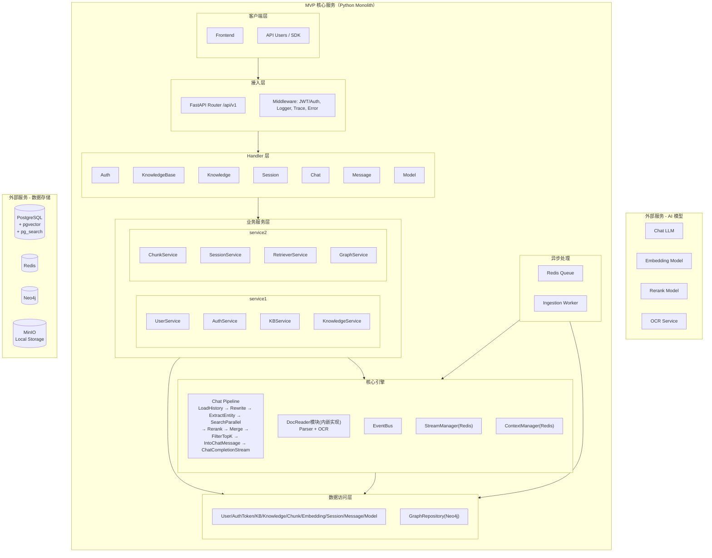
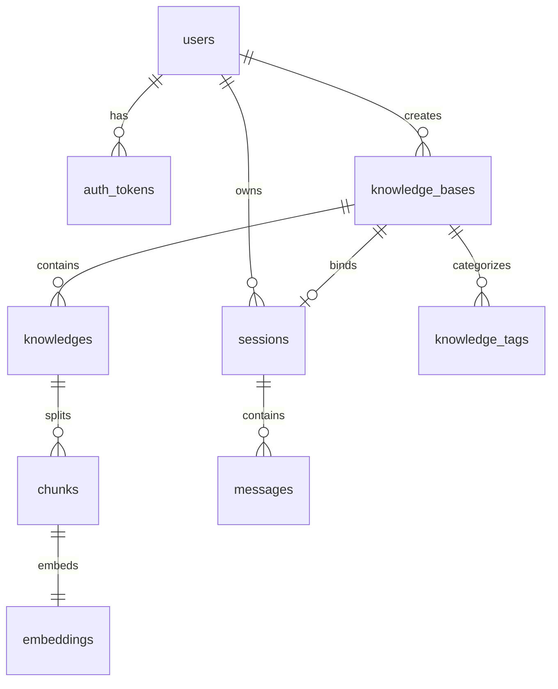

# WeKnora 知识库 Chatbot MVP 项目文档（Python 复现版）

## 0. 文档基线与约束

### 0.1 对齐原则（严格）
- 本文档仅基于 WeKnora 现有能力做 **删减、合并、语言迁移（Go -> Python）**。
- 不新增业务域，不扩展原项目没有的产品能力。
- 允许替换实现中间件（例如 Go Asynq -> Python Redis Worker），但语义与流程保持一致。

### 0.2 参考基线（仓库内）
- 源项目位置：`/Users/taless/Code/OpenProject/WeKnora`
- 架构与分层：`docs/system-architecture.md`、`internal/container/container.go`
- RAG 流程：`docs/WeKnora.md`、`internal/application/service/chat_pipline/README.md`
- 路由与接口：`docs/api/*.md`、`internal/router/router.go`
- 模型管理：`docs/api/model.md`、`docs/BUILTIN_MODELS.md`
- 鉴权：`internal/middleware/auth.go`、`internal/router/router.go`（auth routes）
- 数据模型：`docs/database-architecture.md`、`migrations/versioned/*.sql`
- 流式与事件：`internal/event/event.go`、`internal/stream/factory.go`、`internal/handler/session/stream.go`
- 知识图谱：`docs/KnowledgeGraph.md`、`docs/开启知识图谱功能.md`、`internal/application/service/chat_pipline/extract_entity.go`、`internal/application/service/chat_pipline/search_entity.go`、`internal/application/repository/retriever/neo4j/repository.go`
- 文档解析/OCR：`docreader/README.md`、`docreader/parser/*.py`
- 部署：`docker-compose.yml`、`docs/开发指南.md`、`docs/QA.md`

---

## 1. 背景与目标（Why）

### 1.1 复现动机
- 累积生产级后端经验：本地 Docker 部署、运行维护、故障定位、数据迁移。
- 掌握 WeKnora 亮点：知识库管理、混合检索、图谱增强检索、SSE 对话。
- 训练工程能力：分层架构、事件驱动流水线、可观测性、配置治理。

### 1.2 MVP Goals（必须完成）
- 多用户体系：注册/登录/刷新/登出，JWT 鉴权与 token 持久化。
- 模型管理链路：支持多厂商 provider 类型，支持模型 CRUD 与 provider 列表能力。
- 知识库主链路：KB 管理、知识导入（file/url/manual）、解析状态追踪。
- 文档理解链路：参考 DocReader 实现并内嵌到单服务，包含 OCR。
- 检索链路：关键词 + 向量混合检索，支持重排。
- 知识图谱链路：实体/关系抽取、Neo4j 存储、对话阶段图谱检索增强。
- 对话链路：Session/Message + `knowledge-chat` SSE 流式输出 + 引用返回，首版保留“继续流式输出/停止会话”。
- 本地 Docker 一键运行，具备日志/指标/追踪。

### 1.3 Non-goals（明确不做）
- 不做 Agent 模式（ReAct、工具注册、反思步骤）。
- 不做多租户（仅单工作空间），但保留多用户。
- 不做 MCP 能力。
- 不做多向量后端适配（仅一个后端，见 2.3 解释）。
- 不做多机集群和 K8s，仅本地 Docker。

---

## 2. 范围与对标（Scope & Parity）

### 2.1 模块对标表（WeKnora -> MVP）
| 模块         | WeKnora 参考                                                           | MVP 保留 | 简化说明                                           |
| ------------ | ---------------------------------------------------------------------- | -------- | -------------------------------------------------- |
| 用户与鉴权   | `internal/router/router.go` auth routes, `internal/middleware/auth.go` | 保留     | 去掉租户切换，仅多用户 JWT                         |
| 模型管理     | `docs/api/model.md`, `internal/router/router.go`                       | 保留     | 保留 provider 列表与模型 CRUD                      |
| 知识库管理   | `docs/api/knowledge-base.md`                                           | 保留     | 保留核心 CRUD                                      |
| 知识管理     | `docs/api/knowledge.md`, `internal/application/service/knowledge.go`   | 保留     | 保留 file/url/manual；删除与 Agent 绑定字段        |
| 文档解析     | `docreader/parser/*.py`                                                | 保留     | 不再 gRPC 分服务，按 docreader 思路内置实现        |
| OCR          | `docreader/README.md`                                                  | 保留     | 具体后端实现遵循 docreader 方案，不在 MVP 文档固化 |
| RAG Pipeline | `internal/application/service/chat_pipline/*`                          | 保留     | 仅 Chat 模式，移除 Agent 相关事件                  |
| 混合检索     | `search.go`, `rerank.go`, `merge.go`                                   | 保留     | 向量后端固定单一实现                               |
| 知识图谱     | `extract_entity.go`, `search_entity.go`, `neo4j/repository.go`         | 保留     | 仅 Neo4j，一条图谱实现                             |
| 会话与消息   | `docs/api/session.md`, `docs/api/message.md`                           | 保留     | 保留 continue-stream / stop 能力                   |
| SSE 流       | `internal/handler/session/stream.go`, `internal/stream/*`              | 保留     | 使用 Redis StreamManager                           |
| 异步任务     | `Asynq` 路径（container/router/task）                                  | 保留语义 | Python Worker + Redis Queue                        |
| 可观测性     | tracing/logger/middleware                                              | 保留     | 采用 Python OTel/日志栈                            |

### 2.2 MVP 包含 / 不包含
| 分类     | 包含                                                                              | 不包含                       |
| -------- | --------------------------------------------------------------------------------- | ---------------------------- |
| 核心功能 | 多用户 JWT、模型管理、知识库、检索、图谱、对话、continue-stream/stop              | Agent、MCP、租户             |
| FAQ      | 首版不纳入                                                                        | 可作为后续增量               |
| 存储     | PostgreSQL + pgvector + pg_search(使用paradeDb镜像即可)、Redis、Neo4j、MinIO/本地 | Qdrant、Elasticsearch 多适配 |
| 部署     | Docker Compose 本地部署                                                           | K8s/Helm、多节点             |
| 前端     | 使用 Vue 重新实现（仅覆盖 MVP 接口）                                              | 无需要参考原项目风格         |

### 2.3 关键术语说明（对应你提出的问题）
- “不做多向量后端适配（仅一个后端）”的含义：
  - WeKnora 支持 PostgreSQL / Qdrant / Elasticsearch 等多检索后端切换。
  - MVP 只选 **PostgreSQL + pgvector + pg_search** 这一套，不做多后端抽象适配与切换。
- `Ingestion Worker` 的含义：
  - 指“知识导入后台处理进程”，消费 Redis 队列中的导入任务，执行：解析 -> OCR -> 分块 -> 向量化 -> 图谱抽取 -> 入库。
  - 对标 WeKnora 的异步任务处理语义（Asynq Server + ProcessDocument）。

---

## 3. 系统架构（High-level Design）

### 3.1 架构图（对齐 WeKnora 架构风格，按 MVP 子集裁剪）


### 3.2 关键数据流

#### 文档入库流（异步）
1. 上传知识（file/url/manual）创建 `knowledge` 记录，状态 `pending`。
2. 投递 Redis 队列任务。
3. Worker 消费任务，执行内嵌解析模块（参考 docreader）：解析 + OCR。
4. 分块、向量化写入 `chunks/embeddings`。
5. 若开启图谱抽取，写入 Neo4j。
6. 更新 `parse_status` 为 `completed/failed`。

#### 对话流（同步 + SSE）
1. `knowledge-chat/{session_id}` 接收查询，落库 user/assistant 占位消息。
2. 触发 Pipeline：历史加载、重写、实体抽取、并行检索（chunk + entity graph）。
3. 结果重排、合并、TopK、组装 Prompt。
4. 流式调用 LLM，SSE 推送 answer/references。
5. 完成后更新 assistant 消息内容与状态。

### 3.3 模块职责（输入/输出/边界）
| 模块            | 输入                 | 输出                   | 边界               |
| --------------- | -------------------- | ---------------------- | ------------------ |
| Router/Handler  | HTTP 请求            | JSON/SSE               | 不写复杂业务逻辑   |
| Service         | DTO + 上下文         | 领域结果               | 编排事务、状态流转 |
| Pipeline        | query/session/config | 检索结果 + 生成文本流  | 只负责 RAG 编排    |
| DocReader(内置) | 文件/URL/配置        | 结构化文本块 + OCR结果 | 不感知 HTTP        |
| Repository      | 查询条件             | 持久化对象             | 不含策略逻辑       |
| Worker          | Redis任务            | 处理结果与状态更新     | 不直接对外暴露 API |

### 3.4 技术栈与版本
| 类别      | 选型                                                       |
| --------- | ---------------------------------------------------------- |
| 语言      | Python 3.11                                                |
| Web       | FastAPI + Uvicorn                                          |
| ORM       | SQLAlchemy 2.x                                             |
| 迁移      | Alembic                                                    |
| 主库      | PostgreSQL 16 + pgvector + pg_search(使用paradeDb镜像即可) |
| 缓存/队列 | Redis                                                      |
| 图数据库  | Neo4j                                                      |
| 对象存储  | MinIO / 本地文件                                           |
| 可观测    | OpenTelemetry + Prometheus + JSON Logging                  |
| 部署      | Docker Compose                                             |

---

## 4. 数据与接口设计（Data & API）

### 4.1 鉴权与用户模型
- 模式：多用户 JWT（Access + Refresh）。
- Token 持久化：`auth_tokens` 表，支持撤销与刷新。
- 不支持多租户：去除 `tenant_id` 业务隔离逻辑。
- 参考：`internal/middleware/auth.go`、`internal/router/router.go`（auth routes）、`docs/database-architecture.md` 的 `users/auth_tokens`。

### 4.2 API 设计（语义对齐 WeKnora，路径不要求兼容）
基础路径建议：`/api/v1`（可按项目约定调整）

| 分类      | 方法                    | 路径                                     | 对齐来源                         |
| --------- | ----------------------- | ---------------------------------------- | -------------------------------- |
| Auth      | POST                    | `/auth/register`                         | `router.go`                      |
| Auth      | POST                    | `/auth/login`                            | `router.go`                      |
| Auth      | POST                    | `/auth/refresh`                          | `router.go`                      |
| Auth      | POST                    | `/auth/logout`                           | `router.go`                      |
| Auth      | GET                     | `/auth/me`                               | `router.go`                      |
| Model     | GET                     | `/models/providers`                      | `docs/api/model.md`              |
| Model     | POST/GET/GET/PUT/DELETE | `/models` / `/{id}`                      | `docs/api/model.md`              |
| KB        | POST/GET/GET/PUT/DELETE | `/knowledge-bases` / `/{id}`             | `docs/api/knowledge-base.md`     |
| Knowledge | POST                    | `/knowledge-bases/{id}/knowledge/file`   | `docs/api/knowledge.md`          |
| Knowledge | POST                    | `/knowledge-bases/{id}/knowledge/url`    | `docs/api/knowledge.md`          |
| Knowledge | POST                    | `/knowledge-bases/{id}/knowledge/manual` | `docs/api/knowledge.md`          |
| Knowledge | GET                     | `/knowledge-bases/{id}/knowledge`        | `docs/api/knowledge.md`          |
| Knowledge | GET/DELETE              | `/knowledge/{id}`                        | `docs/api/knowledge.md`          |
| Session   | POST/GET/GET/PUT/DELETE | `/sessions` / `/{id}`                    | `docs/api/session.md`            |
| Session   | POST                    | `/sessions/{session_id}/stop`            | `docs/api/session.md`            |
| Session   | GET                     | `/sessions/continue-stream/{session_id}` | `docs/api/session.md`            |
| Message   | GET                     | `/messages/{session_id}/load`            | `docs/api/message.md`            |
| Chat      | POST                    | `/knowledge-chat/{session_id}`           | `docs/api/chat.md`               |
| Search    | POST                    | `/knowledge-search`                      | `docs/api/chat.md` + `router.go` |

### 4.3 请求/响应与错误码规范
- 成功：
```json
{"success": true, "data": {}, "request_id": "req_xxx"}
```
- 失败：
```json
{"success": false, "error": {"code": 1000, "message": "bad request", "details": {}}}
```
- SSE（对齐 WeKnora）：
```json
{"id":"msg_xxx","response_type":"references|answer|error","content":"...","done":false,"knowledge_references":[]}
```
- 错误码风格对齐：`internal/errors/errors.go`。

### 4.4 幂等策略（MVP）
- 不新增独立幂等子系统（避免超出 WeKnora 能力域）。
- 写操作防重采用 WeKnora 现有语义：
  - 文件导入：`file_hash` 去重（`knowledge` 层）。
  - 请求追踪：`X-Request-ID`。
- 说明：如果后续需要“严格幂等键”，作为后续增强，不纳入本 MVP。

### 4.5 数据模型（单租户多用户版）

#### 4.5.1 关系图（MVP）


#### 4.5.2 关键表（来源于 WeKnora 并裁剪）
- `users`
- `auth_tokens`
- `models`
- `knowledge_bases`
- `knowledge_tags`
- `knowledges`
- `chunks`
- `embeddings`
- `sessions`
- `messages`

说明：
- 以上均可在 `docs/database-architecture.md` 与 `migrations/versioned/*.sql` 找到对应原型。
- 裁剪点：去掉 `tenant_id` 主隔离逻辑，改为 `created_by/owner_id`（用户归属）。

### 4.6 数据一致性策略
- 事务边界：
  - 创建知识时，`knowledge` 记录与任务投递（Redis）要么都成功，要么回滚。
  - 消息创建（user + assistant 占位）同事务。
- 最终一致：
  - 导入任务异步执行，状态机：`pending -> processing -> completed/failed`。
- 删除策略：
  - 软删除优先，异步清理 `chunks/embeddings/neo4j` 关联数据。

### 4.7 数据迁移
- 工具：Alembic（对齐 WeKnora 的版本化迁移思路）。
- 流程：
  - 开发：`alembic revision --autogenerate -m "..."`
  - 发布：`alembic upgrade head`
  - 回滚：`alembic downgrade -1`
- 对标参考：`internal/database/migration.go`、`scripts/migrate.sh`、`migrations/versioned/*`。

---

## 5. 其他生产级能力（可观测性/部署/流水线/日志）

### 5.1 可观测性
- 日志：结构化 JSON，字段至少包含 `request_id/session_id/user_id/kb_id/latency/error_code`。
- 指标：
  - HTTP：QPS、状态码、时延
  - 导入：任务耗时、成功率、重试次数
  - 检索：召回耗时、重排耗时
  - 对话：首 token、总生成耗时
- 追踪：覆盖 ingest、retrieve、graph_search、chat_generate。
- 对标参考：`middleware/logger.go`、`middleware/trace.go`、`internal/tracing/*`。

### 5.2 部署（本地 Docker）
- 必选服务：`app`, `postgres`, `redis`, `neo4j`。
- 可选服务：`minio`（启用对象存储时）。
- 对标参考：`docker-compose.yml`（neo4j/profile/redis/minio）。

### 5.3 运行维护（Runbook）
- 启动：`docker compose up -d`
- 检查：`docker compose ps`
- 日志：`docker compose logs -f app`
- 健康：`GET /health`
- 图谱验证：Neo4j 执行 `MATCH (n) RETURN n LIMIT 50;`
- 参考：`docs/QA.md`、`docs/开启知识图谱功能.md`。

### 5.4 CI（MVP 最小集）
- `ruff + mypy + pytest`
- `alembic upgrade head` 校验
- API smoke test（登录、导入、检索、对话）

---

## 6. 里程碑与计划（Plan）

### 6.1 重构后的执行原则（降低风险优先）
- 里程碑采用“TODO 驱动 + 阶段出口门禁（Exit Criteria）”。
- 单阶段只解决一个主要风险域，控制后端增量在约 `800-1200` 行（M1/M8 允许更低）。
- 每阶段都必须明确“本阶段不做什么”，避免范围漂移。
- 统计口径：按后端目录增量统计（建议 `git diff --numstat` 或 `cloc`），不计自动生成文件与纯文档改动。

### 6.2 TODO 规范（先统一，再执行）
- TODO 命名：`[TAG][P1|P2|P3][状态] 描述`，示例：`[auth][P1][todo] 实现 refresh token 轮换`。
- TAG 集合：`arch/auth/model/kb/knowledge/session/message/chat/sse/ingest/worker/retrieval/rerank/graph/obs/test/ops`。
- 状态集合：`todo/in_progress/blocked/done/deferred`。
- 每条 TODO 必须包含：完成条件、验证方式、归属模块（目录 + 文件）。
- 通过门禁：阶段内 `P1` TODO 必须全部 `done`，`P2/P3` 允许有 `deferred`，但需记录原因。

### 6.3 阶段划分（按每阶段约 1000 行后端增量控制）

| 阶段      | 名称                     | 后端代码增量预算 | 关闭的 TODO 范围                         | 阶段目标                                            |
| --------- | ------------------------ | ---------------- | ---------------------------------------- | --------------------------------------------------- |
| M1(doing) | 架构与文件骨架基线       | 500-900 行       | `arch/*`                                 | 搭建完整骨架、注释规则、目录 README、最小可运行基线 |
| M2        | 用户与鉴权               | 700-1100 行      | `auth/*`                                 | 完成注册登录刷新登出与鉴权中间件闭环                |
| M3        | 模型与知识管理           | 700-1100 行      | `model/*` `kb/*` `knowledge/*`           | 完成模型与知识管理主链路（先元数据闭环）            |
| M4        | 会话与基础对话           | 700-1100 行      | `session/*` `message/*` `chat/*` `sse/*` | 完成会话消息与基础流式对话（不接检索）              |
| M5        | 知识上传与异步入库       | 800-1200 行      | `ingest/*` `worker/*`                    | 完成解析/OCR/分块/向量化/状态机                     |
| M6        | 检索与重排               | 800-1200 行      | `retrieval/*` `rerank/*`                 | 完成混合检索、重排、引用回传（先不启图谱）          |
| M7        | 图谱增强与 Pipeline 合流 | 700-1100 行      | `graph/*`                                | 完成实体抽取 + 图检索增强并接入对话链路             |
| M8        | 可观测性与收尾           | 500-900 行       | `obs/*` `test/*` `ops/*`                 | 完成日志/指标/追踪/回归测试/runbook                 |

### 6.4 各阶段任务具体描述（对标 WeKnora 原项目）

#### M1 架构与文件骨架基线（结构对齐阶段）--- doing
- 对齐来源：`internal/router/router.go`、`internal/container/container.go`、`migrations/paradedb/00-init-db.sql`。
- 关键任务：
  - 建立 Router/Handler/Service/Repository/Infra 分层骨架与依赖注入结构。
  - 创建后端与前端所需文件骨架；每个代码文件顶部写中文职责、边界、TODO。
  - 复杂目录补 `README.md`（例如 `chat_pipeline/`、`worker/`），写清编排流程与设计原则。
  - 建立最小运行链路：`docker compose up`、`/health`、基础 CI。
- 本阶段不做：业务逻辑完整实现、复杂检索与图谱能力。
- Exit Criteria：仓库“可运行 + 可读 + 可迭代”，并完成 TODO 规范落地。

#### M2 用户与鉴权（能力闭环阶段）
- 对齐来源：`RegisterAuthRoutes`、`internal/handler/auth.go`、`users/auth_tokens` 数据域。
- 关键任务：
  - 实现 `/auth/register` `/auth/login` `/auth/refresh` `/auth/logout` `/auth/me`。
  - 实现 token 持久化、刷新与撤销、鉴权中间件与统一错误码。
- 本阶段不做：`/auth/validate`、`/auth/change-password`（除非后续明确纳入范围）。
- Exit Criteria：auth smoke 全通过（注册→登录→me→刷新→登出→旧 token 失效）。

#### M3 模型与知识管理（管理面完善阶段）
- 对齐来源：`docs/api/model.md`、`docs/api/knowledge-base.md`、`docs/api/knowledge.md`。
- 关键任务：
  - 完成 provider 列表与模型 CRUD（保持 provider/type 语义与 WeKnora 对齐）。
  - 完成知识库 CRUD 与知识 `file/url/manual` 入口、列表、详情、更新、删除。
  - 先完成“元数据与状态骨架”；`parse_status` 统一规范为 `pending/processing/completed/failed`（如有 `unprocessed` 需在迁移时映射）。
- 本阶段不做：FAQ、KB copy、批量高级运维接口。
- Exit Criteria：模型配置、建库、建知识记录可在前端闭环。

#### M4 会话与基础对话（交互链路打通阶段）
- 对齐来源：`docs/api/session.md`、`docs/api/message.md`、`docs/api/chat.md`、`internal/handler/session/stream.go`。
- 关键任务：
  - 完成 Session CRUD、Message load/delete。
  - 完成基础 `/knowledge-chat/{session_id}` SSE（纯模型对话，不接检索）。
  - 完成 `/sessions/{session_id}/stop` 与 `/sessions/continue-stream/{session_id}`（历史回放 + 增量轮询 + stop 事件）。
- 本阶段不做：Agent chat、图谱增强、复杂检索。
- Exit Criteria：E2E 可走通“登录→建会话→流式回答→停止→续流”。

#### M5 知识上传与异步入库（ingest 主链路阶段）
- 对齐来源：`internal/router/task.go`、`internal/application/service/knowledge.go`、`docreader/*`。
- 关键任务：
  - 建立 Redis Queue + Worker；消费文档处理任务并维护状态机。
  - 完成解析/OCR/分块/向量化入库，落到 `chunks/embeddings`。
  - 打通失败重试与错误回写，保证任务可观测。
- 本阶段不做：图谱检索增强（仅可预留抽取接口）。
- Exit Criteria：上传后可稳定完成入库，失败原因可追踪。

#### M6 检索与重排（RAG 基础增强阶段）
- 对齐来源：`chat_pipline/search.go`、`rerank.go`、`merge.go`、`filter_top_k.go`、`into_chat_message.go`。
- 关键任务：
  - 完成 pgvector + pg_search 混合检索与重排。
  - 接入 merge/top-k/prompt 组装，SSE 返回引用（references + answer）。
  - 与 M4 的基础 chat 合流为可检索 chat。
- 本阶段不做：实体抽取和图检索增强（推迟到 M7）。
- Exit Criteria：对话可引用已入库内容，且召回与重排可观测。

#### M7 图谱增强与 Pipeline 合流（Graph RAG 阶段）
- 对齐来源：`extract_entity.go`、`search_entity.go`、`retriever/neo4j/repository.go`、`docs/KnowledgeGraph.md`。
- 关键任务：
  - 在 `NEO4J_ENABLE=true` 且 KB 开启抽取时，执行实体抽取、图写入与图检索。
  - 将图检索结果并入检索结果集，保持引用结构一致。
  - 加入开关与降级路径（图谱失败不阻塞主对话）。
- 本阶段不做：Agent/ReAct、MCP。
- Exit Criteria：图谱开启时可提升对话上下文；图谱关闭时主链路不受影响。

#### M8 可观测性与收尾（生产可维护阶段）
- 对齐来源：`middleware/logger.go`、`middleware/trace.go`、`docs/QA.md`、`docs/开发指南.md`。
- 关键任务：
  - 补齐结构化日志、Prometheus 指标、OpenTelemetry 链路追踪。
  - 补齐 smoke/regression，覆盖登录、上传、检索、对话、stop/continue。
  - 完善 runbook（启动、排障、Neo4j 验证、回滚策略）。
- 本阶段不做：新业务功能扩展。
- Exit Criteria：核心链路可监控、可回归、可排障。

### 6.5 依赖关系与并行策略
```
M1 → M2 → M3
M3 → M4
M3 → M5
M4 + M5 → M6 → M7 → M8
```

### 6.6 迭代调整机制（M1 后允许演进）
- M1 完成后，文件规划与模块边界允许在 M2-M8 按实际开发情况调整，不要求一次性完美。
- 任何结构调整都需要同步更新目录 `README.md` 与文件头中文注释/TODO，保持文档与代码一致。
- 若调整影响 TODO 归属，必须在同一阶段完成 TODO 迁移，避免遗留“无人负责”项。
- “无归属文件”定义：文件未归属明确模块目录，或缺少文件头职责/TODO，或未在目录 README 记录。
- M1 后允许新增文件，但必须满足“模块归属 + 文件头注释 + README 记录”。

### 6.7 风险与缓解
| 风险                                                        | 缓解措施                                                     |
| ----------------------------------------------------------- | ------------------------------------------------------------ |
| M1 骨架规划与后续实现不完全匹配                             | 在 M2+ 小步重构，并同步更新 README/TODO                      |
| 单阶段代码量超预算（>1200 行）                              | 立即拆分 TODO 并顺延，禁止临时扩大阶段范围                   |
| `parse_status` 历史枚举不一致（`unprocessed` vs `pending`） | 在迁移脚本统一映射，接口层只暴露统一枚举                     |
| OCR 方案选型耗时                                            | M5 初期允许仅文本解析，OCR 作为同阶段可选增量                |
| 图谱抽取效果不稳定                                          | M7 必须提供开关与降级路径，默认不阻塞主链路                  |
| stop/continue 流控边界复杂                                  | 先按 M4 完成事件回放与 offset 轮询，再在 M8 增加回归测试固化 |

---

## 7. 已确认项

### 7.1 确认决策
- 单工作空间（无租户隔离），但允许多用户并发使用。
- 模型能力需支持多厂商 provider 类型（对齐 WeKnora model provider 设计）。
- 主检索后端固定为 PostgreSQL + pgvector + pg_search(使用paradeDb镜像即可)。
- 图谱后端固定为 Neo4j。
- 文档解析能力参考 docreader 实现，不再走 gRPC，内嵌于同一服务。
- Redis 可用且用于队列、流式事件、上下文缓存。
- FAQ 首版不纳入，作为后续可选增量。
- 首版保留“继续流式输出 / 停止会话”能力。
- API 路径不要求兼容 WeKnora 原路径，仅语义对齐。
- 前端不复现原项目，使用 Vue 重新实现。
- OCR 具体后端实现由开发时按 docreader 方案确定，不在本文档强绑定。
